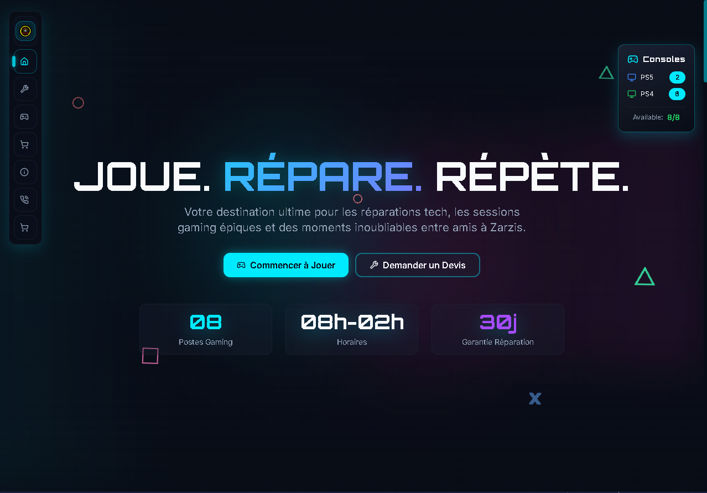
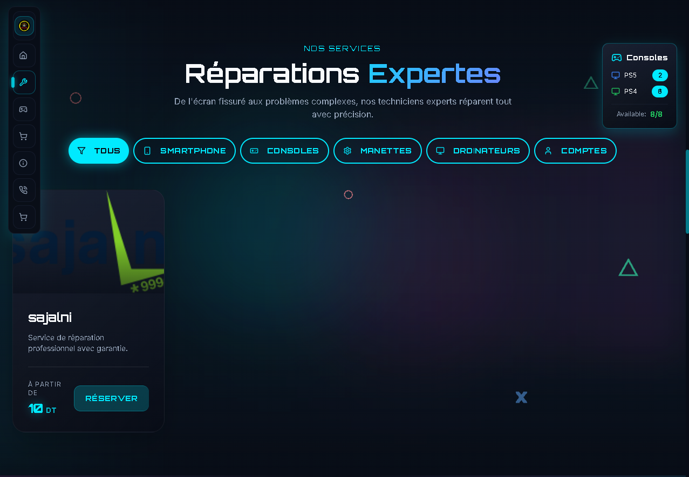
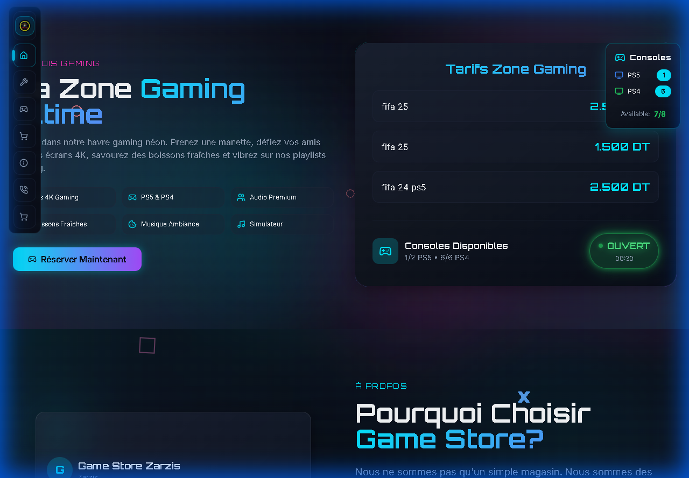

# 🎮 Game Store Zarzis - Management System

[](https://opensource.org/licenses/MIT)
[](https://github.com/OmarABouajaja/Projects)
[](https://www.typescriptlang.org/)
[](https://reactjs.org/)
[](https://supabase.com/)
[](https://vitejs.dev/)

**Modern, full-featured management system for gaming cafés and console rental stores.**

Built with React + TypeScript + Supabase. Features real-time session tracking, inventory management, client loyalty system, and comprehensive analytics.

> 🌐 **Live Demo:** [gamestorezarzis.com.tn](https://www.gamestorezarzis.com.tn/) | 🔧 **API:** [bck.gamestorezarzis.com.tn](https://bck.gamestorezarzis.com.tn/)

> 🌟 **Features:** Trilingual support (EN/FR/AR with RTL), Premium glassmorphism UI, Real-time collaboration, PWA-ready

### 📚 [Read the User Guide (How to Use)](./GUIDE.md)

---

## 📸 Screenshots

<details>
<summary>Click to view screenshots</summary>

### Landing Page


### Expert Repair Services


### Gaming Lounge


</details>

---

## ✨ Features

### 🎯 Core Management
- **Real-time Session Tracking** - Monitor active gaming sessions with live updates
- **Quick Launch Shortcuts** - Start sessions instantly with keyboard shortcuts (1-9, A-Z)
- **Flexible Pricing** - Hourly rates, per-game pricing, and custom tiers
- **Client Self-Service Portal** - Customers can track points, history, and rewards

### 💰 Business Operations
- **Integrated Point-of-Sale** - Complete sales system for products and accessories
- **Smart Inventory** - Stock tracking with automatic low-stock alerts
- **Service Management** - Handle repair requests and maintenance tickets
- **Profit Analytics** - Track expenses and automatically calculate margins

### 👥 Customer Engagement
- **Loyalty Rewards Program** - Automatic points accumulation with free game rewards
- **Client Profiles** - Detailed purchase history and session tracking
- **Secure Authentication** - Optional SMS/Email verification for clients

### 📊 Analytics & Intelligence
- **Real-time Dashboard** - Live revenue, profit, and activity metrics
- **Complete Audit Trail** - Full transaction history with advanced filtering
- **Staff Attendance** - Automatic work hour tracking per device/workstation
- **Custom Reports** - Generate analytics for any date range with CSV/JSON export

### ⚙️ Customization & Control
- **Operating Hours** - Configure weekly schedules with different hours per day
- **Theme Editor** - Customize neon color palette to match your brand
- **Multi-language** - Full support for English, French, and Arabic (with RTL)
- **Data Management** - Export/import functionality for backups and migrations

---

## 🚀 Tech Stack

| Layer | Technology | Purpose |
|-------|-----------|---------|
| **Frontend** | React 18 + TypeScript | Modern UI with type safety |
| **Build Tool** | Vite 6.4 | Fast builds and HMR |
| **Styling** | Tailwind CSS + Shadcn UI | Utility-first CSS + components |
| **State** | TanStack Query + Context API | Server state + global state |
| **Backend** | Supabase | PostgreSQL + Auth + Realtime |
| **Email** | Resend | Transactional emails (3K/month free) |
| **Animations** | Framer Motion | Smooth transitions |
| **Routing** | React Router v6 | Client-side navigation |
| **Forms** | React Hook Form + Zod | Type-safe form validation |
| **Charts** | Recharts | Data visualization |

---

## 📋 Prerequisites

Before you begin, ensure you have the following installed:

- **Node.js** v18.0.0 or higher ([Download](https://nodejs.org/))
- **npm** v9.0.0 or higher (comes with Node.js)
- **Git** ([Download](https://git-scm.com/))
- **Supabase Account** (free tier available at [supabase.com](https://supabase.com))

---

## ⚡ Quick Start

Get up and running in 5 minutes:

### 1. Clone & Install

```bash
git clone https://github.com/OmarABouajaja/Projects.git
cd Projects/Game-Store-Zarzis
npm install
```

### 2. Configure Environment

```bash
cp .env.example .env
```

Edit `.env` with your Supabase credentials:

```env
VITE_SUPABASE_URL=https://your-project.supabase.co
VITE_SUPABASE_ANON_KEY=your-anon-key-here
```

> Get these from: Supabase Dashboard → Settings → API

### 3. Setup Database

**Option A: Fresh Install (Recommended)**
1. Open your project in the [Supabase Dashboard](https://supabase.com).
2. Go to the **SQL Editor**.
3. Copy and run the content of: [docs/database_schema.sql](docs/database_schema.sql)

> [!TIP]
> This script automatically sets up all 15 tables, RLS policies, and core functions. It also includes **Seed Data** (default consoles, pricing, and settings) so you can start testing immediately.

### 4. Create Owner Account

In Supabase Dashboard → Authentication → Users → Add User

Then assign the owner role:

```sql
INSERT INTO public.user_roles (user_id, role)
SELECT id, 'owner'
FROM auth.users
WHERE email = 'admin@gamestore.tn';
```

### 5. Start Development Server

```bash
npm run dev
```

Visit `http://localhost:5173` 🎉

---

## 🎨 Design Philosophy

This system features a **Premium WoW** design aesthetic:

- ✨ **Glassmorphism** - Frosted glass effects with backdrop blur
- 🌈 **Neon Accents** - Vibrant, customizable color palette
- 🎭 **Smooth Animations** - Framer Motion powered transitions
- 📱 **Fully Responsive** - Mobile-first approach, works on all devices
- 🌍 **Trilingual** - English, French, Arabic with full RTL support

---

## 🔐 Security

- ✅ **Row Level Security (RLS)** - All tables protected
- ✅ **Role-Based Access** - Owner/Staff/Client permissions
- ✅ **Secure Authentication** - Supabase Auth
- ✅ **Environment Variables** - Credentials never in code

---

## 🌐 Deployment

This project is deployed using:

| Service | Purpose | URL |
|---------|---------|-----|
| **Cloudflare Pages** | Frontend Hosting | [gamestorezarzis.com.tn](https://www.gamestorezarzis.com.tn/) |
| **Render** | Backend API (Python) | [bck.gamestorezarzis.com.tn](https://bck.gamestorezarzis.com.tn/) |
| **Supabase** | Database + Auth | PostgreSQL + Realtime |
| **Resend** | Email Service | Transactional emails |

---

## 👨‍💻 Author

**Omar A. Bouajaja** — [GitHub](https://github.com/OmarABouajaja)

Built with ❤️ for Game Store Zarzis, Tunisia.

---

<div align="center">

**🎮 Start managing your game store like a pro! 🎮**

⭐ Star this repo if you find it useful!

</div>